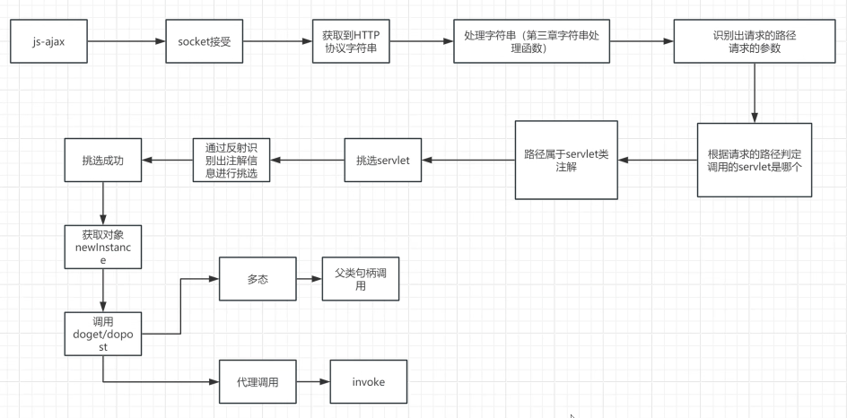
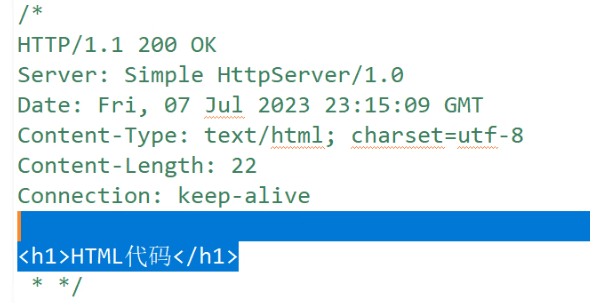
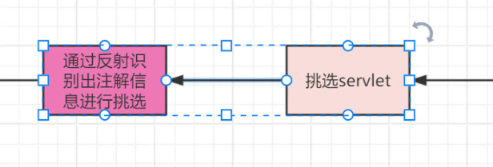
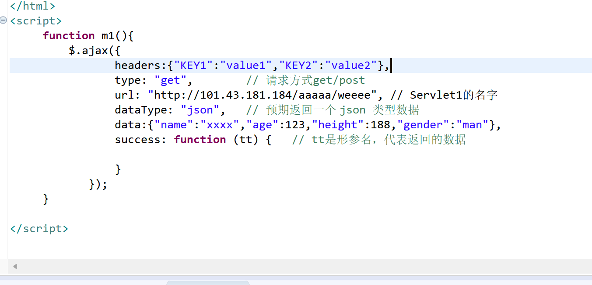
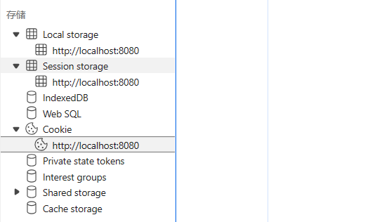
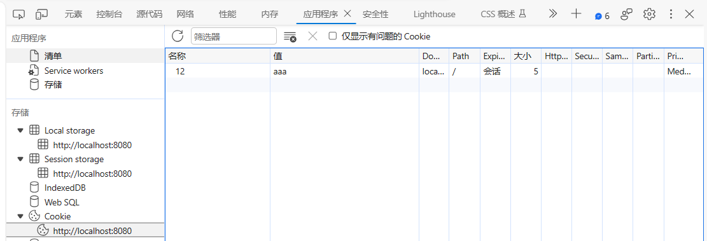
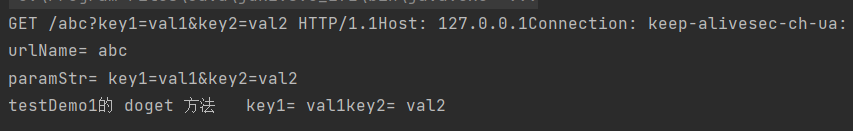
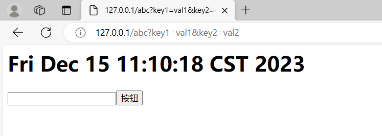
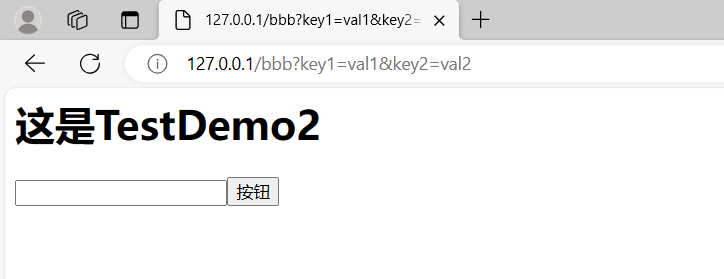
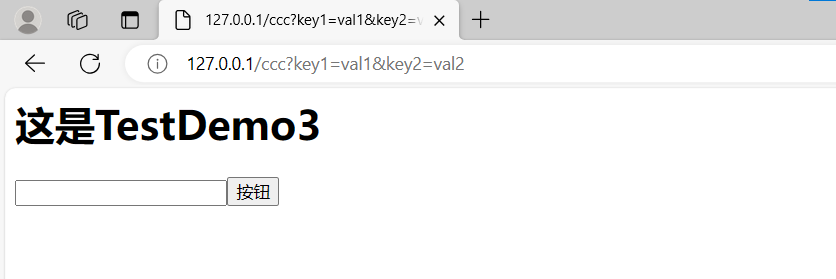

# 流程 图

# 文件 位置
tomcat 下 webapps项目，里的项目，都有一个classes与项目的src对应。  
遍历，把所有java文件调出来，看哪一个包含注解。  
# 挑选 
```java
public class Learn1 {
	
	public static void main(String[] args) throws ClassNotFoundException {
		
		String[] arr = {"com.操作系统.AAA","com.操作系统.bbb", "com.操作系统.ccc"};
		
		Class<?>[] cls = new Class[arr.length];
		
		for (int i = 0; i < cls.length; i++) {
			cls[i] = Class.forName(arr[i]);
		}
		
		for (Class<?> x: cls) {
			WebServlet2 annotation = x.getAnnotation(WebServlet2.class);
			// getAnnotation（入参是指定祖师的类型信息）获取类注解
			if (annotation != null) {
				// 模拟挑选出了servlet（带有注释的类）
			} else {
				continue;
			}
		}
	}
}
```
# socket
一个socket只接收一个来源，不然往回发送时无法区分是哪个。   

这样发回去他就能解析。  
**注意**：记得加上 换行 和 空行。 
# 框架
SpringMVC SpringBoot 摒弃了多态调用，完全只用代理invoke。

# 优化
  
此过程非常慢。    
用map存下来，tomcat启动时，存下来。   
减少对象的创建，没必要每次调用就创建一个。  
每个servlet保持一个对象即可。 也是启动时创建，或者第一次调用时创建，大多数在启动阶段。  
doget,dopost 方法对象 也保留一份就够了。  

单例模式：一个类只需要有一个对象存在。 节省内存（面试点）
但是如果它有属性，在多线程下是不安全的，在多线程下不要设置属性。 （面试点） 

是第一次调用的时候创建一个对象和它的方法对象，然后放入map中，让servlet名字与对象还有它的方法对象做映射，然后下次调用先在map中找。 启动时就加载也可以。  


# 杂记
in.readLine() 一行一行阅读    
指定编码发送和接收。    
http本身就是字符串，我们通过对应字符串的处理，可以获取我们所要的信息。  
类加载器可以自定义  寻找类在哪，加载到内存中。  

ajax有header属性，也可以传输数据。  

  

Local Seesion Cookie 都可以跨页面传数据。  从大到小数据。   

同时，需要保持域的相同才可以。 
如下：107.0.0.1 和 localhost虽然意义上相同，但是不共享。  
Cookie在发起请求会作为http协议的一部分发送，而另两个不会。  



# 实现代码解析：
## 一、构建测试样例
这里我构建了三个：

在运行时，我调用的是TestDemo1（向页面返回一个时间并显示），来测试是否正确。    
TestDemo2：打印“TestDemo2”  
TestDemo3：打印“TestDemo3”  
```java
package test;

import Server.Myrequest;
import Server.Myresponse;
import Server.Servlet1;

import java.io.IOException;
import java.io.UnsupportedEncodingException;
import java.util.Date;

@Servlet1(urlName = "abc")
public class TestDemo1{
    public void doGet(Myrequest request, Myresponse response) throws IOException {
        // 假设，输出key1和key2的val
        String val1 = request.getVal("key1");
        String val2 = request.getVal("key2");

        System.out.println("testDemo1的 doget 方法   " + "key1= " + val1 + "key2= " + val2);

        // 返回值
        String http = "HTTP/1.1 200 OK\r\n" +
                "Server: Simple HttpServer/1.0\r\n" +
                "Date: Fri, 07 Jul 2023 23:15:09 GMT\r\n" +
                "Content-Type: text/html; charset=utf-8\r\n" +
                "Content-Length: 162\r\n" +
                "Connection: keep-alive\r\n" +
                "\r\n" +
                "<h1>" + new Date() + "</h1><input type=\"text\" / ><input type=\"button\"  value=\"按钮\"    />";
        response.getWriter().write(http.getBytes("UTF-8"));
        // 清理缓冲
        response.getWriter().flush();
        response.getWriter().close();
    }

    public void doPost(Myrequest request, Myresponse response) {
        // 假设，输出key1和key2的val
        String val1 = request.getVal("key1");
        String val2 = request.getVal("key2");

        System.out.println("testDemo1的 dopost 方法   " + "key1= " + val1 + "key2= " + val2);
    }
}

```
TestDemo2：bbb
```java
package test;

import Server.Myrequest;
import Server.Myresponse;
import Server.Servlet1;

import java.io.IOException;
import java.io.UnsupportedEncodingException;
import java.util.Date;

@Servlet1(urlName = "bbb")
public class TestDemo2{
    public void doGet(Myrequest request, Myresponse response) throws IOException {
        // 假设，输出key1和key2的val
        String val1 = request.getVal("key1");
        String val2 = request.getVal("key2");

        System.out.println("testDemo1的 doget 方法   " + "key1= " + val1 + "key2= " + val2);

        // 返回值
        String http = "HTTP/1.1 200 OK\r\n" +
                "Server: Simple HttpServer/1.0\r\n" +
                "Date: Fri, 07 Jul 2023 23:15:09 GMT\r\n" +
                "Content-Type: text/html; charset=utf-8\r\n" +
                "Content-Length: 162\r\n" +
                "Connection: keep-alive\r\n" +
                "\r\n" +
                "<h1>" + "这是TestDemo2" + "</h1><input type=\"text\" / ><input type=\"button\"  value=\"按钮\"    />";
        response.getWriter().write(http.getBytes("UTF-8"));
        // 清理缓冲
        response.getWriter().flush();
        response.getWriter().close();
    }

    public void doPost(Myrequest request, Myresponse response) {
        // 假设，输出key1和key2的val
        String val1 = request.getVal("key1");
        String val2 = request.getVal("key2");

        System.out.println("testDemo1的 dopost 方法   " + "key1= " + val1 + "key2= " + val2);
    }
}
```
TestDemo3：ccc
```java
package test;

import Server.Myrequest;
import Server.Myresponse;
import Server.Servlet1;

import java.io.IOException;
import java.io.UnsupportedEncodingException;

@Servlet1(urlName = "ccc")
public class TestDemo3{
    public void doGet(Myrequest request, Myresponse response) throws IOException {
        // 假设，输出key1和key2的val
        String val1 = request.getVal("key1");
        String val2 = request.getVal("key2");

        System.out.println("testDemo1的 doget 方法   " + "key1= " + val1 + "key2= " + val2);

        // 返回值
        String http = "HTTP/1.1 200 OK\r\n" +
                "Server: Simple HttpServer/1.0\r\n" +
                "Date: Fri, 07 Jul 2023 23:15:09 GMT\r\n" +
                "Content-Type: text/html; charset=utf-8\r\n" +
                "Content-Length: 162\r\n" +
                "Connection: keep-alive\r\n" +
                "\r\n" +
                "<h1>" + "这是TestDemo3" + "</h1><input type=\"text\" / ><input type=\"button\"  value=\"按钮\"    />";
        response.getWriter().write(http.getBytes("UTF-8"));
        // 清理缓冲
        response.getWriter().flush();
        response.getWriter().close();
    }

    public void doPost(Myrequest request, Myresponse response) {
        // 假设，输出key1和key2的val
        String val1 = request.getVal("key1");
        String val2 = request.getVal("key2");

        System.out.println("testDemo1的 dopost 方法   " + "key1= " + val1 + "key2= " + val2);
    }
}
```
## 二、自定义注解
我们在使用servlet时，是通过注解来确定的，选取哪个，所以我们先创建一个自己的Servlet注解，用来标记对应的类。    
```java
package Server;

import java.lang.annotation.ElementType;
import java.lang.annotation.Retention;
import java.lang.annotation.RetentionPolicy;
import java.lang.annotation.Target;

@Retention(value = RetentionPolicy.RUNTIME)
@Target(value = {ElementType.METHOD, ElementType.PARAMETER, ElementType.FIELD,ElementType.TYPE})
public @interface Servlet1 {
    public String urlName() default "123";
}

```

## 三、 自定义 request 类、response 类
### Myrequest
使用servlet时，我们用resquest来获取前端传来的参数，所以request中用hashmap来供我们读取数据。  
```java
package Server;

import java.util.HashMap;

public class Myrequest {
    private HashMap<String, String> hash = new HashMap<>();

    // 根据传入查找
    public String getVal(String key) {
        return hash.get(key);
    }
    // 传入key:val
    public void put(String key, String val) {
        hash.put(key, val);
    }
}
```
### Myresponse
同样，我们在处理完请求后，要进行返回，response显然是调用的输出流，我们写一个与servlet类似的用法。  
```java
package Server;

import java.io.OutputStream;

public class Myresponse {
    private OutputStream os; // 输出流

    // 构造方法，把tcp输出流构造进来，为了后面我们输出
    public Myresponse(OutputStream os) {
        this.os = os;
    }
    // 获取输出流
    public OutputStream getWriter() {
        return this.os;
    }
}
```
## 四、反射，创建servlet对象
在使用tomcat时，如果每次调用servlet都重新反射查找文件来创建对象，效率会很低。    

我们可以在tomcat启动时，就把所以的servlet类都找到，并且创建对象，这样在调用时，就可以直接从hashmap中寻找，极大的提高了效率。   

当然类中的doget，dopost方法，我们也一并创建好对象，这样才能invoke代理调用。   

这也是单例模式：一个类只需要有一个对象存在。  
```java
package Server;


import java.io.File;

import java.lang.reflect.Method;
import java.util.HashMap;

public class SearchFile {
    public static HashMap<String, Object[]> map = new HashMap<>(); // servlet类名:{类对象，doget方法类, dopost方法类};

    public static void main(String[] args) throws ClassNotFoundException, InstantiationException, IllegalAccessException, NoSuchMethodException {

    }
    // 初始化
    public static void init() throws ClassNotFoundException, InstantiationException, IllegalAccessException, NoSuchMethodException {
        String path = "D:\\桌面\\自学代码练习\\sevlet\\src\\test"; // 项目路径
        traversalFolder(new File(path)); // 递归寻找java文件
    }
    // 遍历文件夹，找到java文件，创建对象，传入map中
    private static void traversalFolder(File folder) throws ClassNotFoundException, InstantiationException, IllegalAccessException, NoSuchMethodException {

        File[] files = folder.listFiles();
        for (File f: files) {
            if (f.isDirectory()) { // 如果是文件夹，继续遍历，递归
                traversalFolder(f);
            } else { // 若不是，判断是否是java文件
                // 获取路径，反射创建
                String filePath = f.getAbsolutePath(); // D:\桌面\自学代码练习\sevlet\src\test\TestDemo1.java
                String path = filePath.split("src")[1]; // Path= \test\TestDemo1.java
                path = path.substring(1, path.length()); // Path= test\TestDemo1.java
                // 去掉.java后缀，这里我一开始不小心替换成空格，找错找了两小时。。。，我还以为前面错了呢
                path = path.replace(".java", ""); // Path= test\TestDemo1
                path = path.replace("\\", "."); // test.TestDemo1
                // 反射，根据路径，获取此类
                Class<?> c1 = Class.forName(path);
                // 获取注释
                Servlet1 annotation = c1.getAnnotation(Servlet1.class);
                if (annotation != null) {
                    String urlName = annotation.urlName(); // 获取名字
                    // 放入map中
                    map.put(urlName, new Object[]{c1.newInstance(), c1.getDeclaredMethod("doGet", new Class[] {Myrequest.class, Myresponse.class}), c1.getDeclaredMethod("doPost", new Class[] {Myrequest.class, Myresponse.class})});

                }
            }
        }
    }

}
```
## 五、接收请求，调用方法
用来处理传进来的请求，并调用方法。 

创建 Myrequest 和 Myresponse 对象。   
request调用put，把发送来的key：val放入。  
response传入输出流，为了我们回应。  

获取urlName对应的hashMap，invoke调用doget方法。 

这里我默认调用的doget方法，大家可以自己改写，加一个传入参数和if判断。    

```java
package Server;

import java.io.File;
import java.io.OutputStream;
import java.lang.reflect.InvocationTargetException;
import java.lang.reflect.Method;

public class Tomcat {

    public static void chose(String urlName, String[] params, OutputStream os) throws InvocationTargetException, IllegalAccessException {

        Myrequest ret = new Myrequest();
        Myresponse res = new Myresponse(os);
        // 让ret记录参数hash{key:val}
        for (String str: params) {
            String key = str.split("=")[0];
            String val = str.split("=")[1];
            ret.put(key, val);
        }
        Object[] arr = SearchFile.map.get(urlName); // 获取对应的{类，该类的doGet方法类，该类的doPost的方法类}
        // 获取doGet方法
        Method m = (Method) arr[1];
        // 代理
        m.invoke(arr[0], ret, res);
    }
}
```

## 六、处理传入的TCP协议
也是我们写的tomcat的启动位置。  

TCP协议其实就是字符串，我们通过处理字符串来获取我们需要的部分。
TCP协议的样子：  
```java
GET /ccc?key1=val1&key2=val2 HTTP/1.1Host: 127.0.0.1Connection: keep-alivesec-ch-ua: "Not_A Brand";v="8", "Chromium";v="120", "Microsoft Edge";v="120"sec-ch-ua-mobile: ?0sec-ch-ua-platform: "Windows"Upgrade-Insecure-Requests: 1User-Agent: Mozilla/5.0 (Windows NT 10.0; Win64; x64) AppleWebKit/537.36 (KHTML, like Gecko) Chrome/120.0.0.0 Safari/537.36 Edg/120.0.0.0Accept: text/html,application/xhtml+xml,application/xml;q=0.9,image/webp,image/apng,*/*;q=0.8,application/signed-exchange;v=b3;q=0.7Sec-Fetch-Site: noneSec-Fetch-Mode: navigateSec-Fetch-User: ?1Sec-Fetch-Dest: documentAccept-Encoding: gzip, deflate, brAccept-Language: zh-CN,zh;q=0.9,en;q=0.8,en-GB;q=0.7,en-US;q=0.6
```   
例如：调用的servlet方法，传入的data等。  

这里可以自己改写成多线程的方式。    
还有处理字符串并不太统一，有些特殊情况没有考虑。  
  
```java
package Server;

import java.io.*;
import java.lang.reflect.InvocationTargetException;
import java.net.ServerSocket;
import java.net.Socket;
import java.util.Scanner;

public class server {
    public static void main(String[] args) throws IOException, InvocationTargetException, IllegalAccessException, ClassNotFoundException, InstantiationException, NoSuchMethodException {

        SearchFile.init(); // 初始化，把所有类先实例一个对象，重复利用，算是优化
        ServerSocket ss = new ServerSocket(80);
        Socket socket = ss.accept();

        // 缓冲输入流
        BufferedReader br = new BufferedReader(new InputStreamReader(socket.getInputStream()));

        // 接收传来的协议（字符串）
        String httpstr = ""; // 拼接传过来的协议
        String line;
        while ((line = br.readLine()) != null && !line.isEmpty()) {
            httpstr += line;
        }
        System.out.println(httpstr);

        // 处理字符串
        // 截取我们需要
        String str = httpstr.split("/")[1].split(" ")[0]; // abc?&key1=val1&key2=val2
       // 获取传入的路径（想要请求哪个servlet)
        String urlName = str.split("\\?")[0];
        System.out.println("urlName= " + urlName); // abc

        // 获取参数{key=value}数组
        String paramStr = str.split("\\?")[1];
        System.out.println("paramStr= " + paramStr); // key1=val1&key2=val2
        String[] params = paramStr.split("&"); // {"key1=val1","key2=val2"}
        OutputStream os = socket.getOutputStream();
        // 把参数给tomcat类处理, 这里就简单写，默认get,想调用post,可以自己改写一下,output传入
        Tomcat.chose(urlName, params, os);

        socket.close();
        ss.close();
    }
}
```

## 七、测试运行
运行main方法，然后浏览器中输入以下内容：  
```java
127.0.0.1:80/abc?key1=val1&key2=val2
```
调用成功：


返回成功：


另两个test也测试成功：  
```java
127.0.0.1:80/bbb?key1=val1&key2=val2
```


```java
127.0.0.1:80/ccc?key1=val1&key2=val2
```



